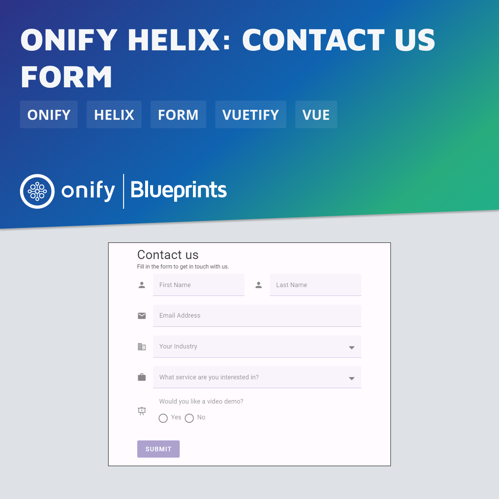

[](https://www.repostatus.org/#wip)

# Onify Blueprint: Helix - Contact us form

This Blueprint for Onify Helix showcases how to create a simple "Contact Us" form using Vuetify and Onify Helix components. The form includes fields for first name, last name, email, industry, and service interest, as well as a radio button option for requesting a video demo. It validates user inputs to ensure all required fields are correctly filled before submission. Upon successful submission, it displays a confirmation alert thanking the user and confirming receipt of their inquiry. The form manages the submission state and automatically resets after processing.



## Requirements

* Onify Helix (v0.30.0 or higher)
  
## Setup

1. Copy `contact-us.vue` to `/src/custom/pages` in your Onify Helix app.
2. Add to `contact-us` section to `/config/pages.yml` (see example below)

**/config/pages.yml**

```yml
- name: contact-us
  path: /contact-us
  import: ../src/custom/pages/contact-us.vue
```

## Support

* Community/forum: https://support.onify.co/discuss
* Documentation: https://support.onify.co/docs
* Support and SLA: https://support.onify.co/docs/get-support

## License

This project is licensed under the MIT License - see the [LICENSE](LICENSE) file for details.
